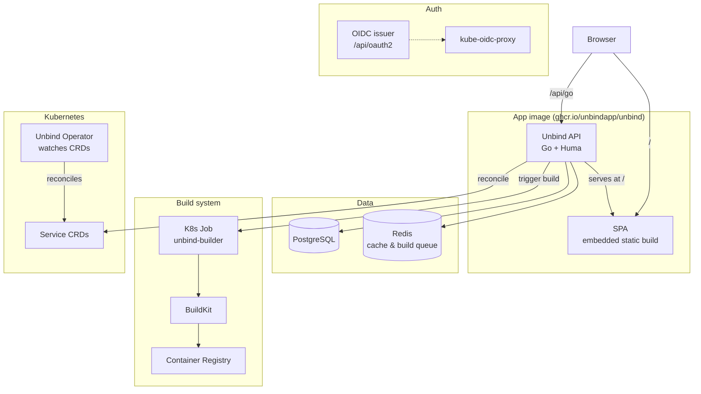

# Unbind

<div align="center">


**Kubernetes-Based Platform as a Service**

_Effortlessly deploy, scale, and manage applications on Kubernetes_

[**Quick Start**](#quick-start) • [**Local Development**](#local-development) • [**Architecture**](#architecture) • [**Releases**](#builds--releases)

</div>

---

## What is Unbind?

Unbind is a **Platform as a Service (PaaS)** for managing all kinds of applications. It provides:

- **Zero-configuration deployments** from Git repositories and Docker images
- **Intelligent build system** powered by [BuildKit](https://github.com/moby/buildkit) and [Railpack](https://github.com/railwayapp/railpack)
- **Security** integrating OAuth2/OIDC with native [Kubernetes RBAC](https://kubernetes.io/docs/reference/access-authn-authz/rbac/)
- **Metrics** with the [Victoria k8s stack](https://docs.victoriametrics.com/helm/victoriametrics-k8s-stack/) or [Prometheus kube stack](https://github.com/prometheus-community/helm-charts/tree/main/charts/kube-prometheus-stack)
- **Templates** for zero-config deployments of popular open-source products (Plausible, Supabase, WordPress, MinIO, and more)
- **Production-grade databases with backups** via [operators](https://kubernetes.io/docs/concepts/extend-kubernetes/operator/) and Helm charts — backing up to any S3-compatible storage

---

## Monorepo layout

```
unbind/
├── apps/
│   ├── web/        # TanStack Router SPA (Vite, React)
│   ├── api/        # Go + Huma API. Serves the SPA.   module: github.com/unbindapp/unbind-api
│   ├── operator/   # Kubebuilder operator (CRDs)      module: github.com/unbindapp/unbind-operator
│   └── installer/  # Bubble Tea TUI + install.sh      module: github.com/unbindapp/unbind-installer
├── deploy/
│   ├── compose/    # Local Postgres + Redis for development
│   └── k8s/        # Kustomize manifests used by the deploy CI step
├── Dockerfile          # App image (SPA + API)  -> ghcr.io/unbindapp/unbind
├── Dockerfile.builder  # Builder image          -> ghcr.io/unbindapp/unbind-builder
├── Makefile            # Local dev / build orchestration
├── LICENSE             # MIT (the code is MIT, the brand is not — see TRADEMARK.md)
└── TRADEMARK.md
```

Each Go app keeps its own module path, so there are no cross-app import rewrites.
Run `go` commands from inside the app directory (e.g. `cd apps/api`).

---

## Architecture



### How the API serves the SPA

The web app and the API ship in **one image and one deployment**. The Go binary embeds the
built SPA (`go:embed` over `apps/api/internal/web/dist`) and serves it as the router's
`NotFound` fallback (`apps/api/internal/web/web.go`):

- Registered API routes at root (`/auth`, `/teams`, `/health`, `/.well-known/*`, …) take precedence.
- Anything else serves a static asset, or falls back to `index.html` for client-side routing.
- Hashed assets are cached immutably; `config.json` is never cached — mirroring the old nginx rules.

The SPA talks to the API **same-origin** at `/api/go` (set in `apps/web/public/config.json`). In a
deployment the ingress strips the `/api/go` and `/api/oauth2` prefixes so the API receives root
paths; in local dev the Vite proxy strips them. Because the API and SPA share an origin, the auth
session cookie is first-party — no cross-site cookie/CORS handling needed.

---

## Local development

You do **not** need Docker to run the app itself (only Postgres + Redis).

### 1. Start infrastructure

```bash
make dev-infra     # Postgres + Redis via deploy/compose/docker-compose.yaml
```

Configure `apps/api/.env` (see `apps/api/config/config.go` for all keys), then run migrations:

```bash
cd apps/api && go run ./cmd/cli migrate
```

### 2a. Two-process dev loop (recommended — hot reload for the UI)

```bash
make dev-api       # API on :8089 (serves API + a placeholder SPA shell)
make dev-web       # Vite dev server on :5173, proxies /api/go -> http://localhost:8089
```

Open **http://localhost:5173**. The SPA hot-reloads; API calls are proxied to the local API.
To point the UI at a remote API instead, set `VITE_DEV_API_PROXY` (defaults to the hosted API):

```bash
cd apps/web && VITE_DEV_API_PROXY=https://api.unbind.app npm run dev
```

### 2b. Single binary (production-like — the API serves the real SPA)

```bash
make app           # build SPA -> embed into apps/api/internal/web/dist -> build apps/api/bin/unbind
make run           # build + run the single binary on :8089
```

Then open **http://localhost:8089** — the API serves the real SPA at `/` and the API at `/api/go`.

> **Can I run the API standalone?** Yes. `cd apps/api && go run ./cmd/api` always works — a committed
> placeholder `index.html` lets the embed compile without a web build, so every API route works and
> `/` serves a minimal shell. Run `make app` (or `make embed`) first if you want the real UI baked in.

Interactive API docs: **http://localhost:8089/docs** (OpenAPI 3.1).

### Code generation & migrations (apps/api)

```bash
cd apps/api
make ent                          # regenerate Ent entities
make interfaces                   # regenerate service interfaces + mocks
make migrate NAME=add_feature     # new versioned migration (applied automatically on API startup)
```

### Bootstrapping an admin user

```bash
cd apps/api
go run ./cmd/cli user:create  --email=admin@unbind.app --password=secure_password
go run ./cmd/cli group:create --name=superuser --description="Platform Administrators"
go run ./cmd/cli group:add-user --email=admin@unbind.app --group-name=superuser
go run ./cmd/cli group:grant-permission --group-name=superuser --resource-type=system --resource-id="*" --action=admin
go run ./cmd/cli sync:group-to-k8s
```

---

## Builds & releases

CI is path-aware — a change only triggers the work it affects:

| Workflow | Trigger | Builds |
| --- | --- | --- |
| `ci.yml` | push / PR | tests for whichever of api / web / operator / installer changed |
| `build-app.yml` | push to `master` touching `apps/web`, `apps/api`, or the Dockerfiles | `unbind` + `unbind-builder` images (multi-arch) and deploys |
| `build-operator.yml` | push to `master` touching `apps/operator` | `unbind-operator` image (multi-arch) |
| `release.yml` | push tag `v*.*.*` | all images at `:<tag>` **and** installer binaries, in one GitHub Release |

Releases are driven entirely by tagging this repo — there is no cross-repo dispatch.

| Component | Image |
| --- | --- |
| App (SPA + API) | `ghcr.io/unbindapp/unbind` |
| Builder | `ghcr.io/unbindapp/unbind-builder` |
| Operator | `ghcr.io/unbindapp/unbind-operator` |

The installer is published as release assets and installed with:

```bash
curl -fsSL https://raw.githubusercontent.com/unbindapp/unbind/main/apps/installer/install.sh | sh
```

---

## License

The **code** is licensed under the [MIT License](LICENSE). The **Unbind brand** is not — see
[TRADEMARK.md](TRADEMARK.md).

<div align="center">

[Report Bug](https://github.com/unbindapp/unbind/issues) • [Request Feature](https://github.com/unbindapp/unbind/issues) • [Join Discord](https://discord.gg/r8Q3zNTgbp)

</div>
